# Social Network API
## 18 NoSQL: Social Network API

## Task

```md
Build an API for a social network web application where users can share their thoughts, react to friends' thoughts, and create a friend list. 

Use Express.js for routing, a MongoDB database, and the Mongoose ODM. In addition, you may optionally use a JavaScript date library of your choice or the native JavaScript `Date` object to format timestamps.

No seed data is provided, so you’ll need to create your own data using Insomnia after you’ve created your API.
```

## Technologies used:

```md
Express JS    
MongoDB     
Mongoose     
MomentJS     
```


## User Story

```md
AS A social media startup
I WANT an API for my social network that uses a NoSQL database
SO THAT my website can handle large amounts of unstructured data
```

## Acceptance Criteria

```md
GIVEN a social network API
WHEN I enter the command to invoke the application
THEN my server is started and the Mongoose models are synced to the MongoDB database
WHEN I open API GET routes in Insomnia for users and thoughts
THEN the data for each of these routes is displayed in a formatted JSON
WHEN I test API POST, PUT, and DELETE routes in Insomnia
THEN I am able to successfully create, update, and delete users and thoughts in my database
WHEN I test API POST and DELETE routes in Insomnia
THEN I am able to successfully create and delete reactions to thoughts and add and remove friends to a user’s friend list
```


## Walkthrough Videos:

- Start application's server:

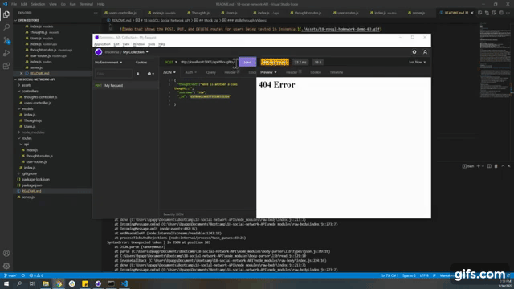

- GET all Users, GET all Thoughts:

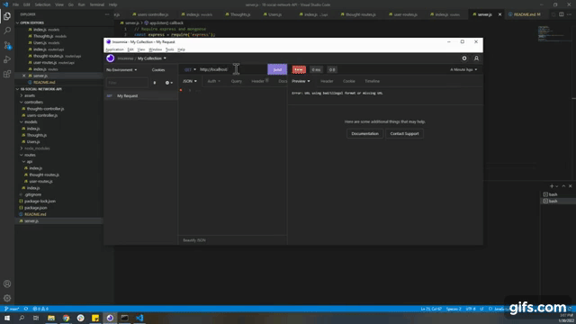

- POST and GET User:

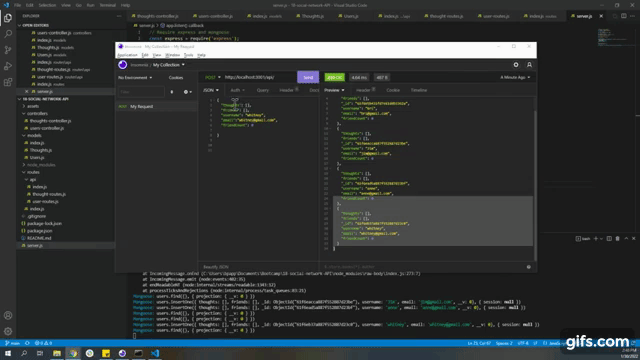

- GET single User:


- PUT User:

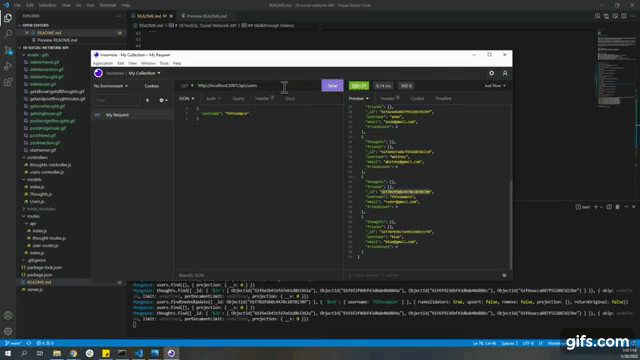

- DELETE User:

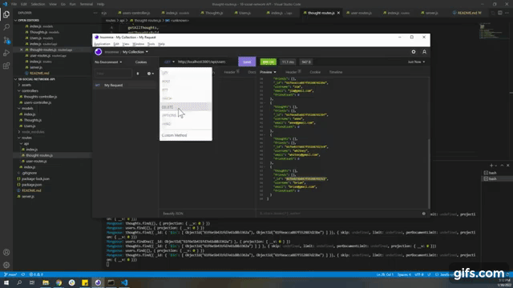

- POST and GET Thoughts:

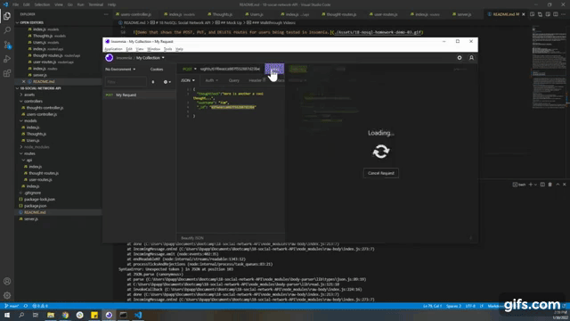

- GET one Thought:

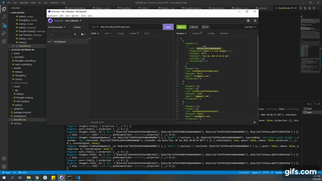

- PUT Thought:

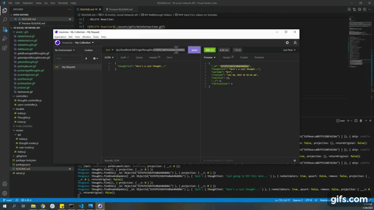

- DELETE Thought:

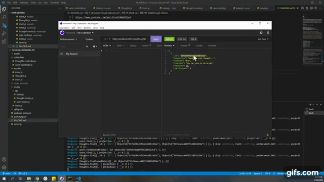

- POST and GET Reaction: 

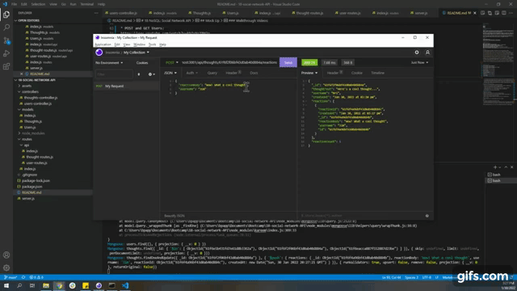

- DELETE Reaction:

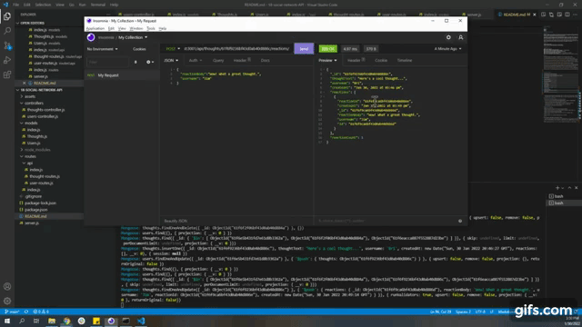

- POST and GET Friend


- DELETE Friend:

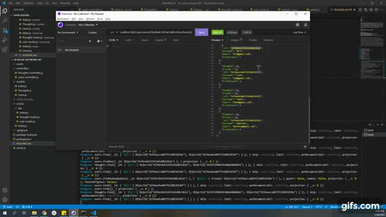

### View FULL videos on Youtube:

- [Start application's server, GET all Users, GET all Thoughts:](https://www.youtube.com/watch?v=z-K96aksFaY)
- [POST and GET Users](https://www.youtube.com/watch?v=kbTvYcTBHJo)
- [GET single User](https://www.youtube.com/watch?v=3Pl5cfh8KMQ)
- [DELETE User](https://www.youtube.com/watch?v=xxDpO_Ha_AA)
- [PUT User](https://www.youtube.com/watch?v=TPrHYeD4G0M)
- [POST and GET Thoughts](https://www.youtube.com/watch?v=gpGNm9j9_-Q)
- [GET one Thought](https://www.youtube.com/watch?v=VBdeRBmIq6U)
- [PUT Thought](https://www.youtube.com/watch?v=928C0x4P_gY)
- [DELETE Thought](https://www.youtube.com/watch?v=F4J-_f8ITjg)
- [POST and GET Reaction](https://www.youtube.com/watch?v=Rr-5oTKqFOA)
- [DELETE Reaction](https://www.youtube.com/watch?v=e0CKif-AowY)
- [POST and GET Friend](https://www.youtube.com/watch?v=IxvBWPqpfKA)
- [DELETE Friend](https://www.youtube.com/watch?v=k3_IiLFUNvs)


## CONTACT ME:

- [Github](https://github.com/bripap)  
- email: bpappas302@gmail.com


